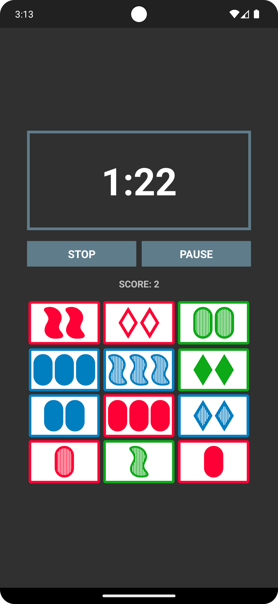

## Card Clicks

Card Clicks is a fun and challenging card game where players find sets of three cards as fast as they can before the timer runs out. Each trait (color, fill, number, and shape) must be entirely different or entirely the same for each card in the set.

## Download

https://github.com/scottmangiapane/card-clicks/releases

You can download the latest `.apk` file from the release page and sideload it onto your Android device.

## Screenshots

|  |  |  |
| ------------- | ------------- | ------------- |
