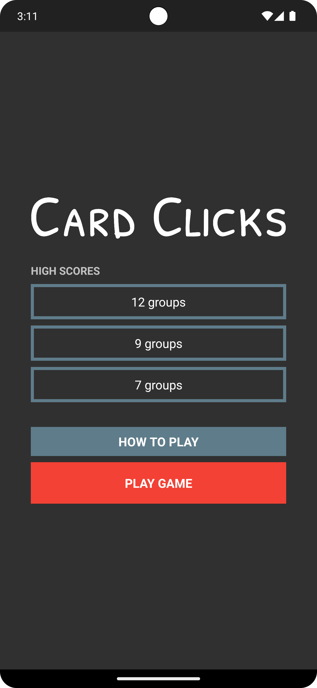

## Card Cliques

Card Cliques is a fun and challenging card game in which players find as many cliques as they can before the timer runs out. A clique is a group of three cards where each trait (color, shape, fill, or number) is all different or all the same for each card in the clique.

## Download

https://play.google.com/store/apps/details?id=com.scottmangiapane.cardcliques

## Screenshots




## Build Instructions

* Install the required tools
* Create a new project in Android Studio
  Package name: com.scottmangiapane.cardcliques
* Replace the contents of /app/source/main/ with this repo
* Add any libraries to /libs/
* Add any dependencies to /app/build.gradle

## Required Tools

* Android Studio
* Android Software Development Kit
* Java Development Kit

## Dependencies

In the project's `app/build.gradle` file, add the following dependency.
```groovy
dependencies {
    compile 'com.android.support:appcompat-v7:24.1.1'
}
```
