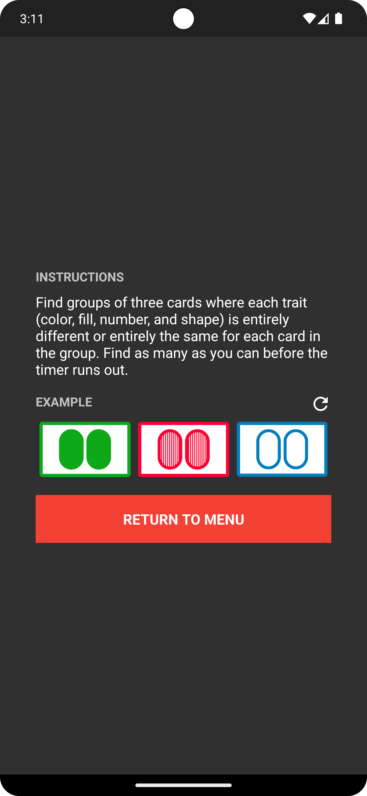

## Card Cliques

A clique is a group of three cards where each trait (color, fill, number, and shape) is entirely different or entirely the same for each card. Find as many cliques as you can before the timer runs out.

## Download

https://play.google.com/store/apps/details?id=com.scottmangiapane.cardcliques

## Screenshots

